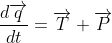

# SUICIDE BURN CALCULATOR (for KSP)

This script calculates suicide burn trajectory out of flight parameters.

## Equations
This to share mutual understanding about variables...

With ,

We have: 

## Flat terrain at altitude zero, no atmosphere:
Checkout branch: "flat"

